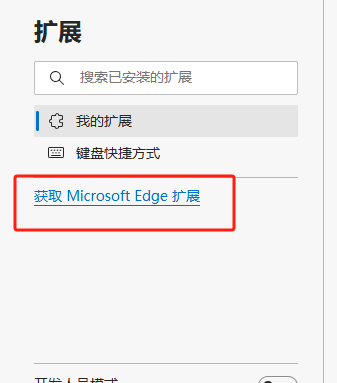
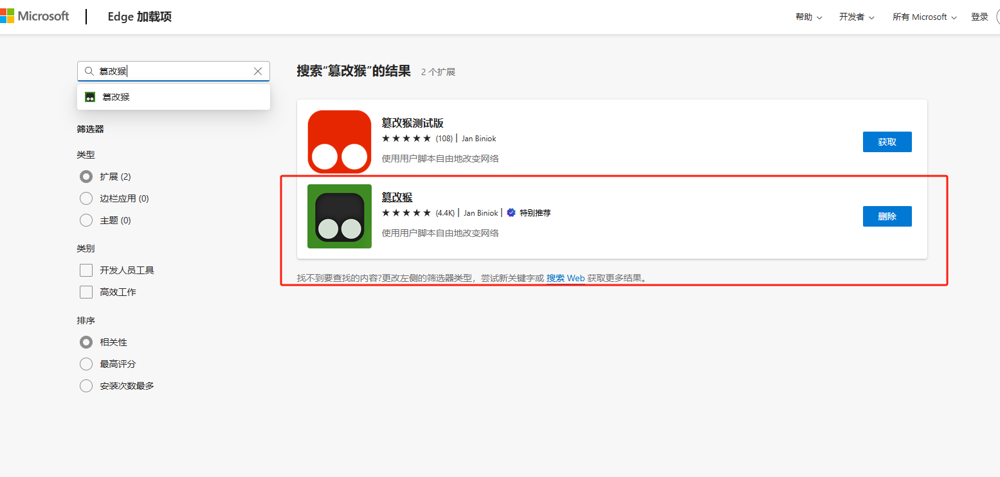
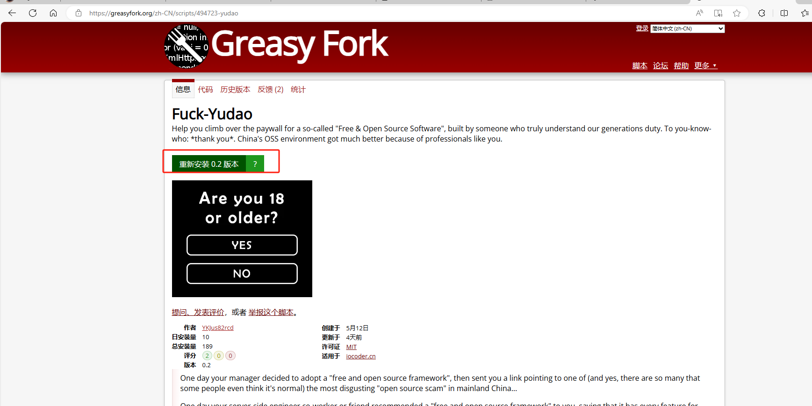
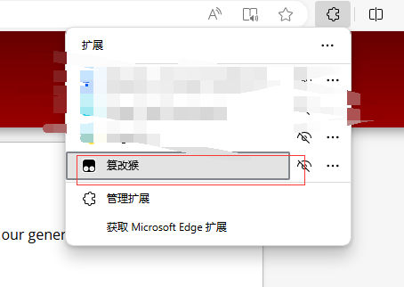
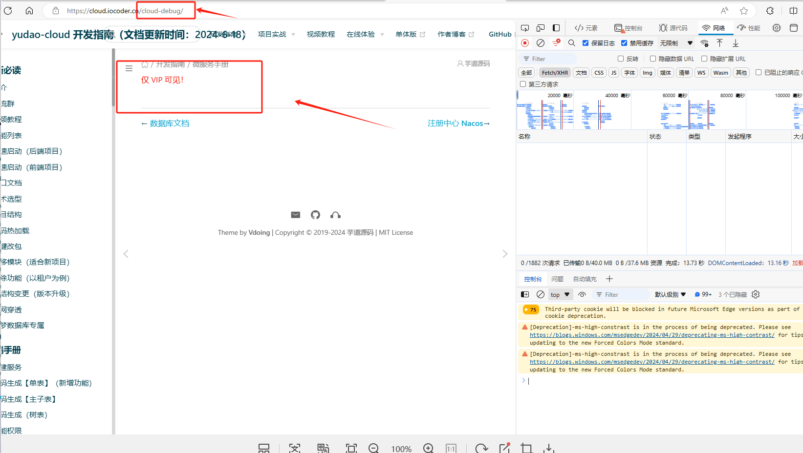
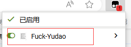
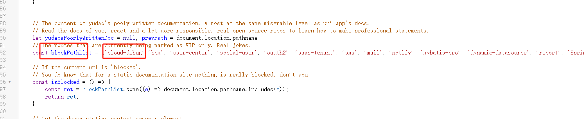

1. 浏览器搜索脚本猴插件 推荐edge
1. 
1. 管理扩展
1. 
1. 获取
1. 
1. 浏览器输入地址<https://greasyfork.org/zh-CN/scripts/494723-yudao>
1. 安装
1. 
1. 扩展会出现
1. 
1. 如果点击某个链接发现显示这个
1. 
1. 复制路由地址
1. 右键点一下
1. 找到这个地方 加入对应路由
1. 
1. 解锁
1. 
2. 如需sql 视频 和 他们的更新，可以看这个链接 https://blog.csdn.net/weixin_38083655/article/details/136337437
