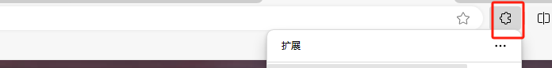

1. 浏览器搜索脚本猴插件 推荐edge （如果网络不好加载不出在线图片，可以下载【在线文档怎么看.docx】）
1. 
1. 管理扩展
1. 
1. 获取
1. 
1. 浏览器输入地址<https://greasyfork.org/zh-CN/scripts/494723-yudao>
1. 安装
1. 
1. 扩展会出现
1. 
1. 如果点击某个链接发现显示这个
1. 
1. 复制路由地址
1. 右键点一下
1. 找到这个地方 加入对应路由
1. 
1. 解锁
1. 
2. 如需付费模块的 sql（无法通过文档下载，作者放知识星球了） 视频 和 他们的更新，可以看这个链接 http://47.102.101.57:8848/buy/19

